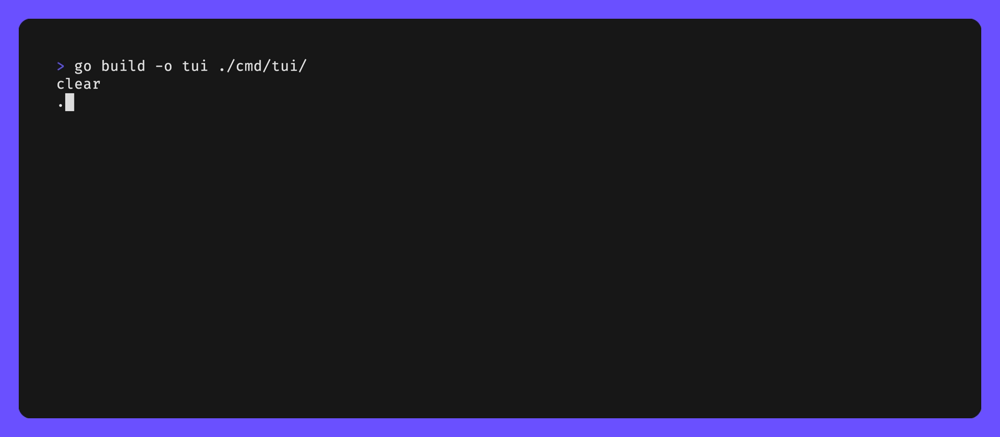

# Mancala-GO

If you're unsure what Mancala is, take a look [here](https://www.thesprucecrafts.com/how-to-play-mancala-409424) (or Google it if my link is broken).

This is a little personal project I created whilst learning Golang to test the power of the standard library, and also experiment with a few packages like:

- [Slog](https://pkg.go.dev/golang.org/x/exp/slog) (it was just coming out of experimental at the time and not yet adopted in my workplace)
- [Bubble Tea](https://github.com/charmbracelet/bubbletea) & [Bubbles](https://github.com/charmbracelet/bubbles) by [Charm](https://charm.sh/)

I'm also taking the opportunity to try out a few Golang devtools like [Air](https://github.com/cosmtrek/air), [Delve](https://github.com/go-delve/delve), and (not Go specific) [DevContainers](https://code.visualstudio.com/docs/devcontainers/containers). I also recommend checking out [Lazygit](https://github.com/jesseduffield/lazygit) if you haven't already. It's by no means new to my toolkit, but it's awesome and made with Go.

Any feedback is much appreciated :)

## Inspirations
- [sku Sudoku](https://github.com/fedeztk/sku): Bubble Tea, Bubbles
- [gambit Chess](https://github.com/maaslalani/gambit): [Bubble Tea](https://github.com/charmbracelet/bubbletea), [Bubbles](https://github.com/charmbracelet/bubbles), [Wish](https://github.com/charmbracelet/wish)
- [mancala](https://github.com/pcriv/mancala): Core game logic, testing, REST API

## Roadmap

Some more things I'm thinking of adding:
- Algorithm opponents like MiniMax and/or Monte-Carlo.
- Remote play with SSH (maybe [Wish](https://github.com/charmbracelet/wish)), WebSockets, or something else (this stuff is not my forte). So far I'm leaning towards SSH because from what I can tell I'd need a central server for the WebSocket approach. 
- REST API to interact with the core engine, which I'd then deploy :)

## Gifs

You may notice some `*.tape` files in the repo. These are used to generate the gifs used for the docs (like seen at the top). This is done using [VHS](https://github.com/charmbracelet/vhs) which is another awesome tool by Charm. It provides a simple format for creating terminal recordings.